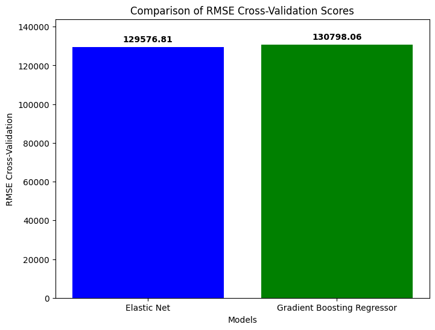
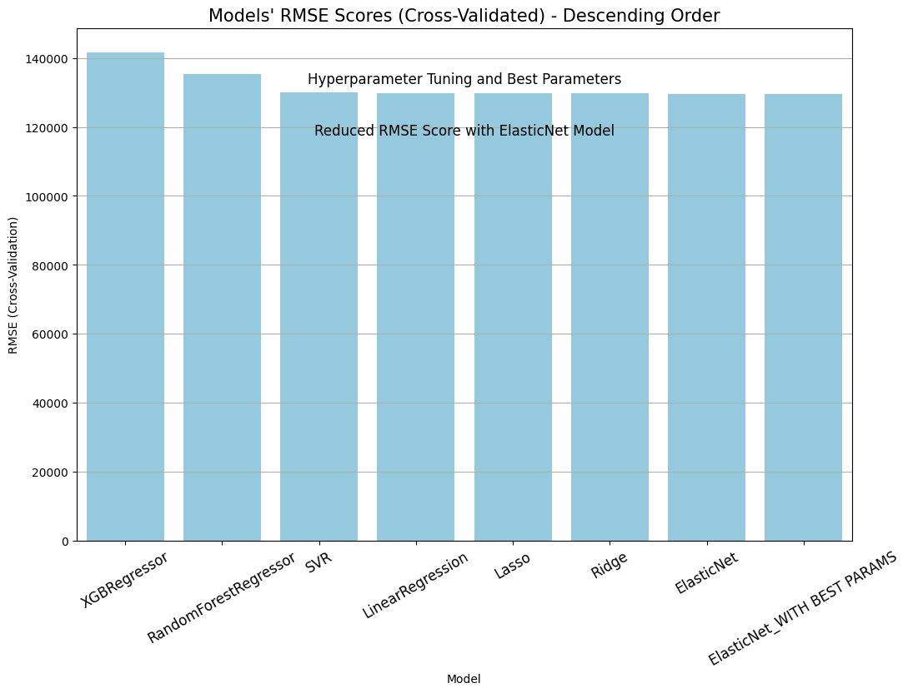
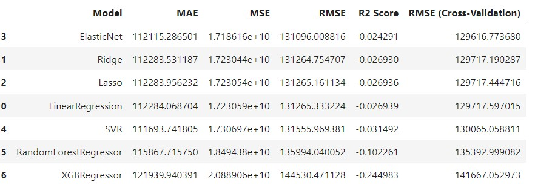
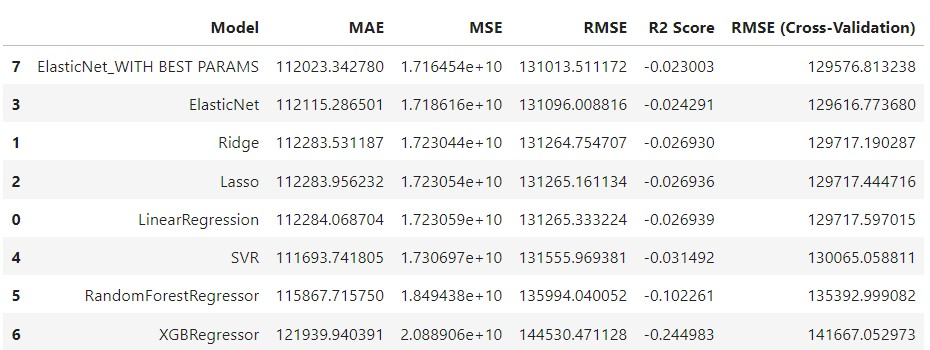
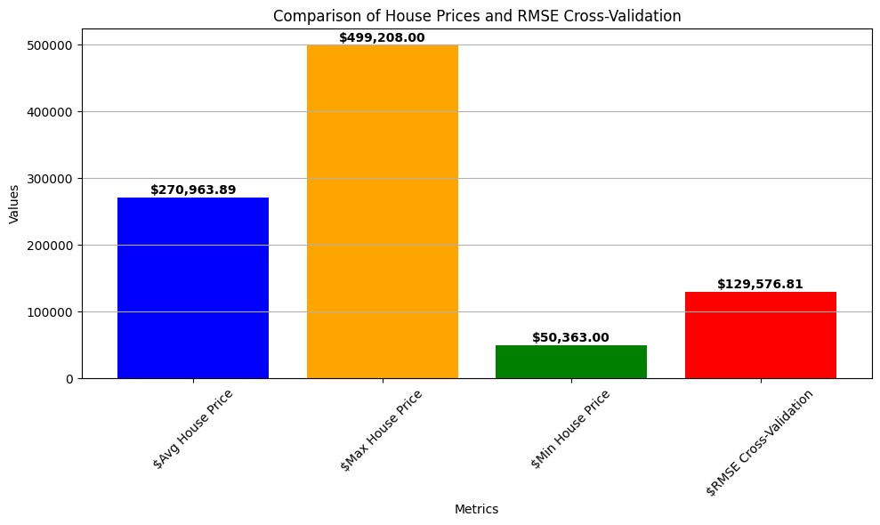

<body>

<h1> House Sale Price Prediction</h1>

<h2>Data Preprocessing</h2>

  This project focuses on predicting house sale prices. Below are the steps taken for data preprocessing:

<h3>Step 1: Installation of Required Libraries</h3>

  The initial step involves installing necessary libraries from the <code>requirements.txt</code> file.

<h3>Step 2: Data Cleaning</h3>

  The dataset stored in the "DATA" folder as <code>sample_dataset.csv</code> underwent thorough cleaning. Steps included outlier removal, handling duplicate entries, and eliminating unwanted columns.

<h3>Step 3: Preprocessed Data</h3>

  Post-cleaning, the preprocessed data was saved as <code>preprocessed_data.csv</code> in the "DATA" folder.

<h3>Step 4: Data Splitting</h3>

  The dataset was split into training and testing sets (<code>X_train</code>, <code>y_train</code>, <code>X_test</code>, <code>y_test</code>), which were stored in NumPy data format in the "DATA" folder.

<h2>Regression Model Training</h2>

  For regression model training, the following steps were undertaken:

<h3>Step 1: Regression Models and Metrics</h3>

  In the <code>Task 2_Regression.ipynb</code> file within the "Code" folder, regression models were implemented, and metrics such as MAE, MSE, RMSE, R2 Score, and RMSE (Cross-Validation) were evaluated.

<h3>Step 2: Model Evaluation</h3>

  Various regression models like Linear Regression, Ridge Regression, Lasso Regression, Elastic Net, Support Vector Machines, Random Forest Regressor, XGBoost Regressor were compared based on their performance metrics. See the image 'jpg1' in the "IMG" folder.

<h3>Step 3: Model Deployment using Streamlit</h3>

  The selected Elastic Net model with the best parameters was used to create a <code>`model.pkl` </code> file. Additionally, an <code> `app.py` </code>code> file was created for deployment using Streamlit.

 RUN THE MODEL USING CMD <code>"streamlit run app.py"</code>code>

<h2>Assumptions:</h2>
<ul>
  <li>I have assumed that the data is prone to overfitting, leading to high RMSE scores.</li>
  <li>To validate this assumption, I conducted checks for underfitting and overfitting.</li>
  <li>Upon analysis, I found the model to be underfitting.</li>
  <li>Therefore, I applied Gradient Boost Regressor to address this issue.</li>
  <li>However, the RMSE score obtained from <code>Gradient Boosting Regressor</code> was higher compared to the Elastic Net model. </li>
  <li>Thus, considering the data's linear relationship favoring Elastic Net's regularization, the RMSE CV score was found to be better for Elastic Net, indicating its superior performance in this context.</li>
  
  <li>Hence, opting for the Elastic Net model with the best parameters could be a better choice for making predictions.</li>
</ul>

<h2>Visualizations</h2>

Here are some visualizations from the project:

1. Comparison of House Prices and RMSE Cross-Validation score with Elastic Net best params:

2. Performance metrics of Elastic Net model with best parameters (Decreased RMSE):

3. House Prices vs RMSE :

<h2>File Structure</h2>

<pre>
- Code
  - Task 1_Preprocessing.ipynb
  - Task 2_Regression.ipynb
  - app.py
- DATA
  - sample_dataset.csv
  - preprocessed_data.csv
  - X.npy
  - y.npy
  - X_test.npy
  - X_train.npy
  - y_test.npy
  - y_train.npy
- IMG
  - jpg1
  - jpg2
  - jpg3
  - jpg4
  - jpg5
</pre>

  This README provides an overview of the steps involved in the House Sale Price Prediction project, including data preprocessing, regression model training, evaluation, and deployment using Streamlit.

</body>

